# Proyecto: API REST (CRUD) hecho con Node JS, Express, MongoDB, Mongoose, y Docker

[LINK AL BACKEND(RAILWAY)](https://proyecto-api-rest-mongo-production.up.railway.app/)

## Software a instalar

- [Postman](https://www.postman.com/downloads/).
- [MongoDB Compass](https://www.mongodb.com/try/download/compass).
- [Docker](https://www.docker.com/get-started/).

## Paquetes de Node JS

- [nodemon](https://www.npmjs.com/package/nodemon).
- [dotenv](https://www.npmjs.com/package/dotenv).
- [env-var](https://www.npmjs.com/package/env-var).
- [Express](https://expressjs.com/en/5x/api.html).
- [body-parser](https://www.npmjs.com/package/body-parser).

## Ejecutar el proyecto localmente

1. Clonar el repositorio.
2. Abrir el Visual Studio Code.
3. Ejecutar `npm install`.
3. Crear el archivo `.env` utilizando la plantilla.
4. Ejecutar `docker compose up -d`.
5. Ejecutar `npm run dev`.

📝Se recomienda utilizar el `PORT` 3000 en la plantilla.

## Prueba con MongoDB Compass

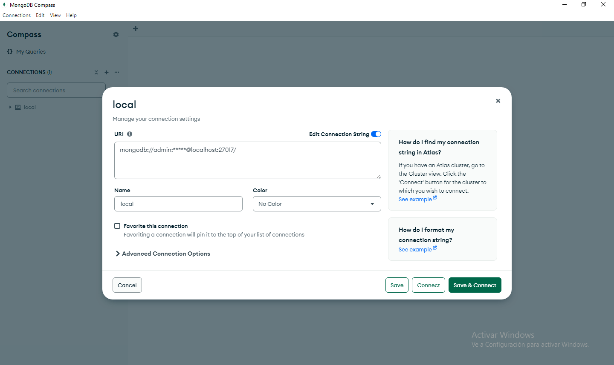
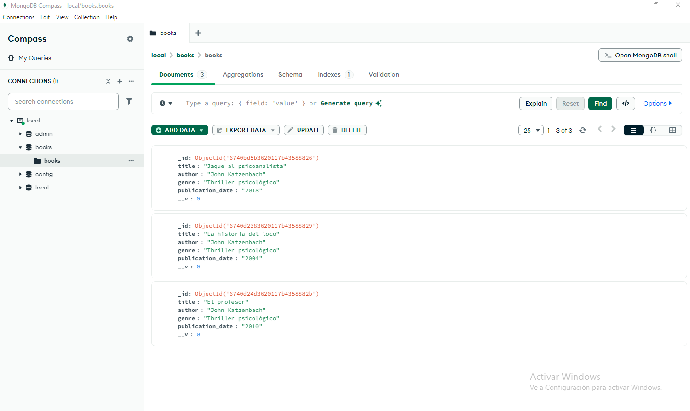

## Prueba con Postman

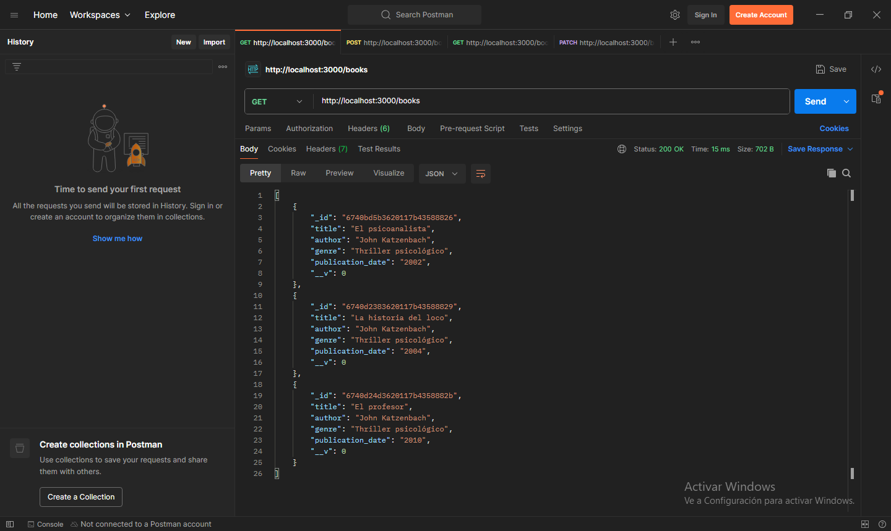
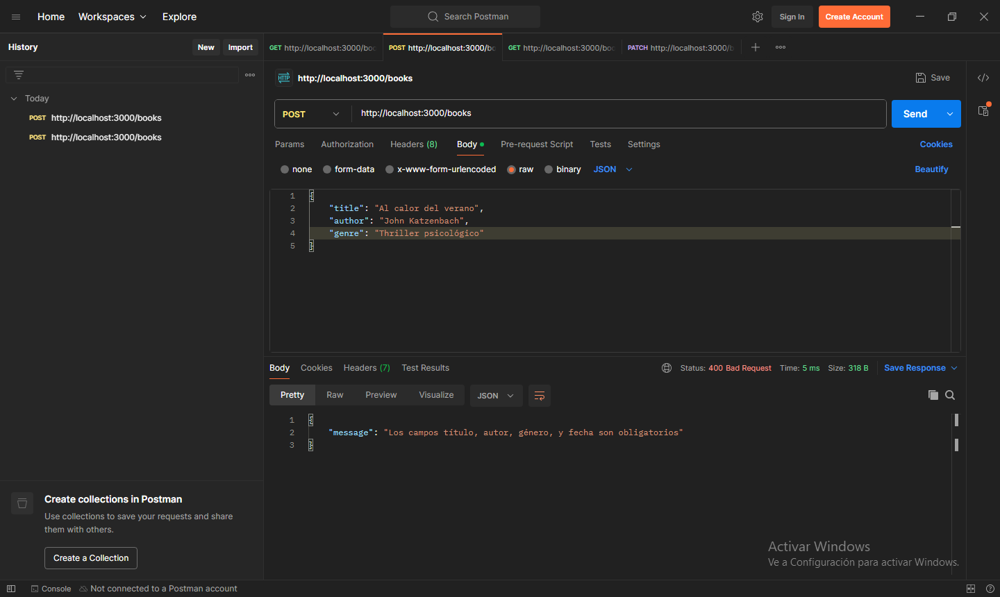
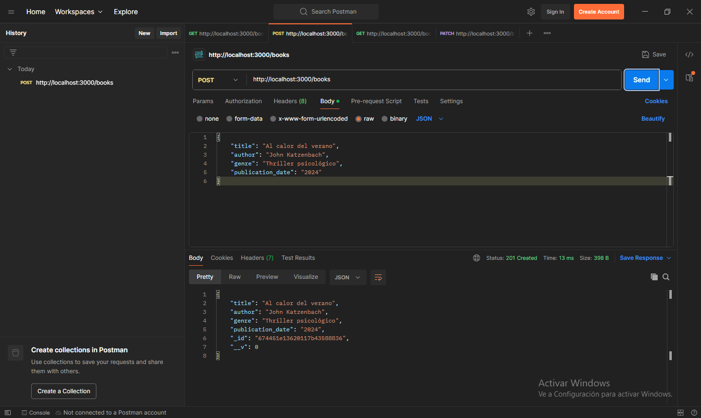
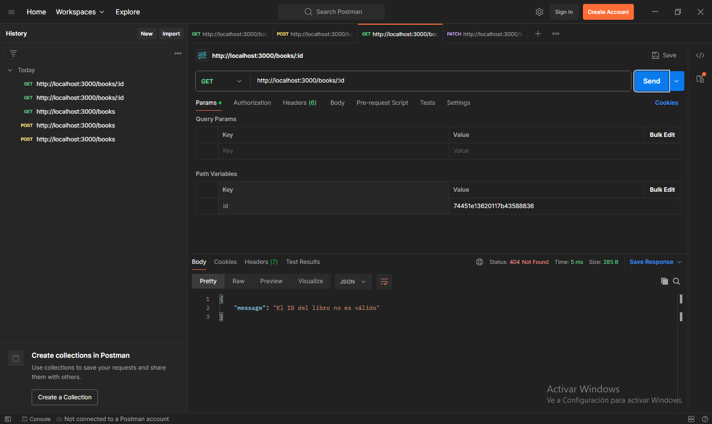
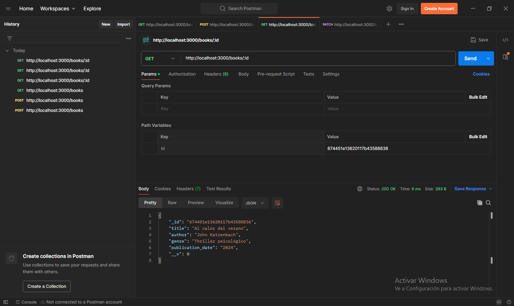
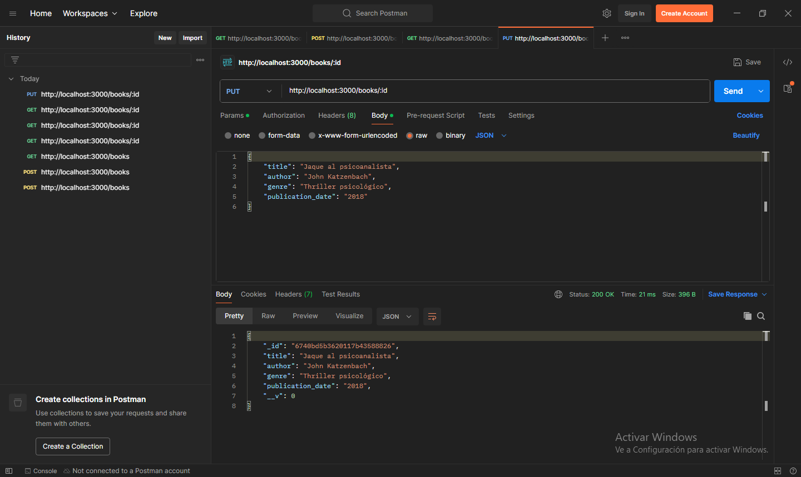
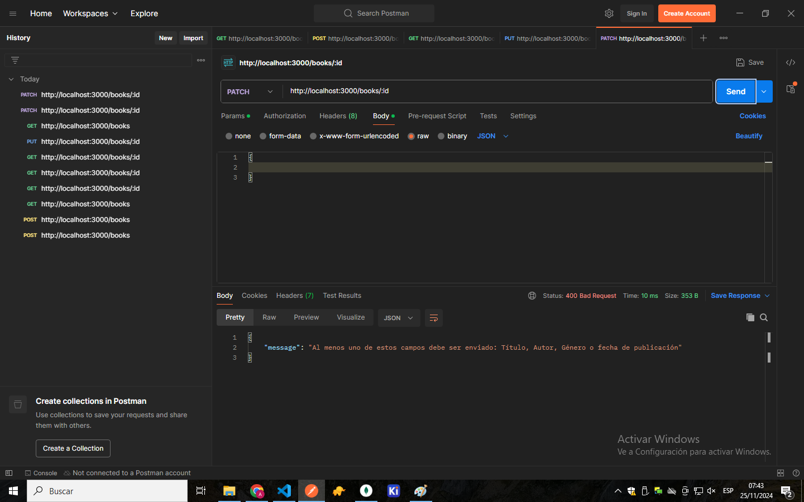
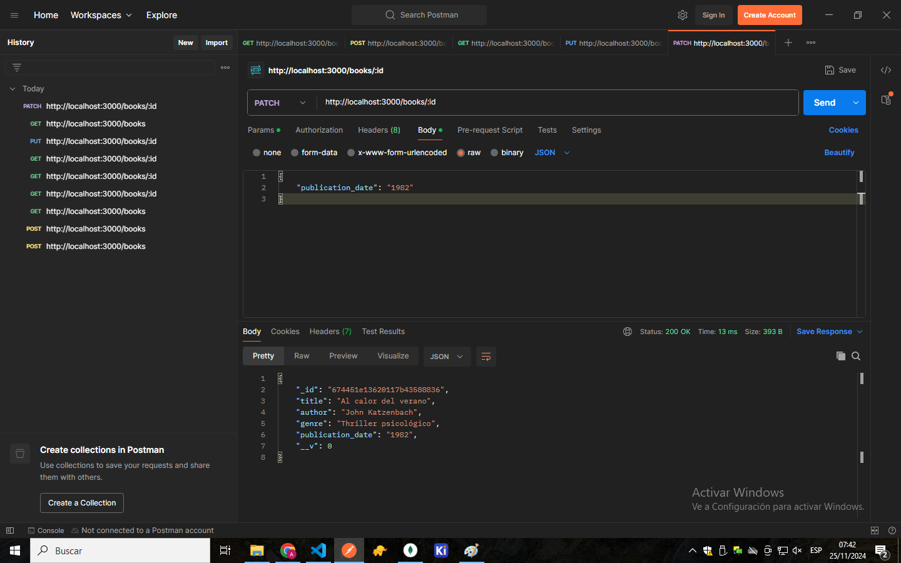
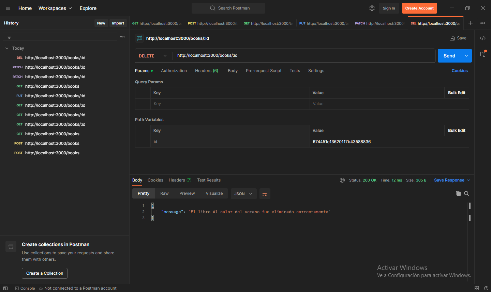

Autor: Ing. Andres Chaparro